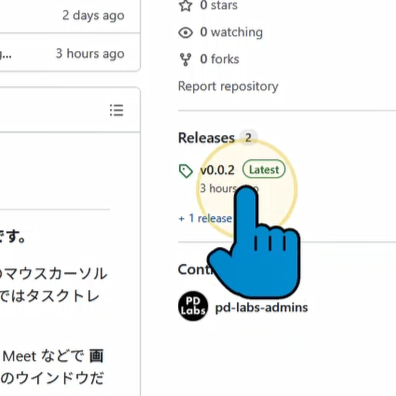
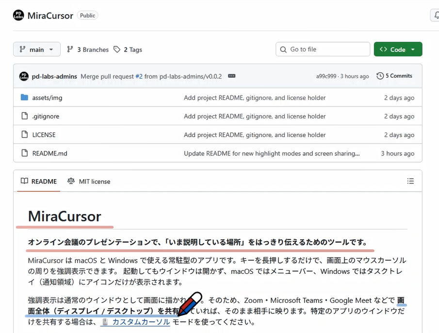
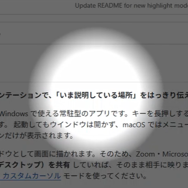
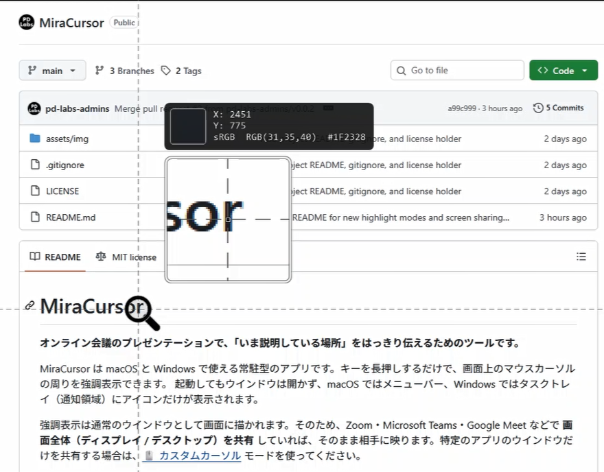

# MiraCursor

**オンライン会議のプレゼンテーションで、「いま説明している場所」をはっきり伝えるためのツールです。** 「Mira」はスペイン語で「見て！」という意味があるそうで、ここから「MiraCursor」という名前にしました。

MiraCursor は macOS と Windows で使える常駐型のアプリです。設定したキーを長押しするだけで画面上のマウスカーソルの周りを強調表示できます。起動してもウインドウは開かず、macOS ではメニューバー、Windows ではタスクトレイ（通知領域）にアイコンだけが表示されます。

---

## 目次

- [できること](#できること)
- [動作環境](#動作環境)
- [ダウンロードとインストール](#ダウンロードとインストール)
- [必要な権限](#必要な権限)
- [使い方](#使い方)
- [設定](#設定)
- [アップデート](#アップデート)
- [アンインストール](#アンインストール)
- [よくある質問・トラブルシューティング](#よくある質問トラブルシューティング)
- [ライセンス](#ライセンス)

---

## できること

MiraCursor には 4 種類の「強調表示モード」があります。設定で決めたキー（トリガーキー）を長押しすると、そのキーに割り当てたモードが始まります。同時に使えるモードは 1 つだけです。

### カスタムカーソル

マウスカーソルそのものを通常のカーソル・円形・指差し・指差し棒・虫眼鏡・懐中電灯などの画像や、任意の画像に変更することができます。特定のウインドウだけを画面共有しているときでも相手に見えます。カーソルの動きに合わせた残像や、クリックした位置に波紋も表示できます。



### ペン

マウスのドラッグで画面に線を描けます。左ボタンと右ボタンで別々の色・太さ・線の種類を使えます。45 度単位のまっすぐな線を描く「直線モード」もあります。描いた線は、モードを終えるとすべて消えます。描いた内容を含めて画面をキャプチャし、クリップボードやファイルに保存することもできます。



### ライト

マウスカーソルの周りを強調します。画面全体を薄暗くしてカーソルの周りだけを明るく表示する「スポットライト」と、画面は暗くせずにカーソルの周りに半透明の色を重ねる「ハイライト」から選べます。カーソルを動かすと、強調する部分も一緒に動きます。



### ズーム

マウスカーソルの周りを拡大して表示します（ルーペ）。カーソルを中心にした十字線や、カーソル位置の X / Y 座標も表示できます。カーソル位置の色を `RGB(255,0,0)` や `#FF0000` の形式で表示し、クリックで色の値を選んだ形式でクリップボードにコピーすることもできます。



---

## 注意点：画面共有時の見え方

Cisco Webex、Slack、Microsoft Teams、Zoomなどのコミュニケーションツールを使い、オンライン会議で画面共有する場合、共有範囲に応じて「相手側の見え方」は以下となります。「ウインドウ共有」を多用される方はカスタムカーソルを中心にご利用ください。

- デスクトップ共有
    - ペン・ライト・ズームなどの効果は共有相手にも表示されます。
    - カスタムカーソルも共有相手に表示されます。
- ウインドウ共有
    - ペン・ライト・ズームなどの効果は共有相手にも **表示されません**
    - カスタムカーソルも共有相手に表示されます。

---

## 動作環境

| OS | 対応バージョン | 備考 |
| --- | --- | --- |
| macOS | macOS 13 Ventura 以降 | Apple Silicon / Intel の両方に対応しています。ズームは macOS 14 Sonoma 以降で使えます。 |
| Windows | Windows 10 / 11（x64） | Arm 版の Windows でも、エミュレーションで動作します。.NET などの追加ソフトウェアを別途インストールする必要はありません。 |

---

## ダウンロードとインストール

GitHubの [Releases](https://github.com/pd-labs-admins/MiraCursor/releases/latest) から、お使いの OS 用ファイルをダウンロードしてください。

| OS | ダウンロードするファイル |
| --- | --- |
| macOS | `MiraCursor-x.y.z-macos.dmg` |
| Windows | `MiraCursor-x.y.z-windows-x64.msi` |

<details>
<summary>リリースに含まれるファイルの一覧</summary>

| ファイル | 用途 |
| --- | --- |
| `MiraCursor-x.y.z-macos.dmg` | macOS 用のインストーラー（通常はこちら） |
| `MiraCursor-x.y.z-macos.zip` | macOS 用のアプリ（zip）。自動アップデートでも使います |
| `MiraCursor-x.y.z-windows-x64.msi` | Windows 用のインストーラー（通常はこちら）。自動アップデートでも使います |
| `MiraCursor-x.y.z-windows-x64.zip` | Windows 用のポータブル版（インストール不要） |
| `MiraCursor-x.y.z-*.sha256` | ファイルの SHA-256 チェックサム |

</details>

### macOS

1. `MiraCursor-x.y.z-macos.dmg` を開きます。
2. `MiraCursor.app` を `Applications`（アプリケーション）フォルダへドラッグします。
3. アプリケーションフォルダの **MiraCursor** を起動します。
4. 初回起動時に「入力監視」の許可を求められます。[必要な権限](#必要な権限) を参考に許可してください。

> **「開発元を検証できないため開けません」と表示される場合**
> MiraCursor は Apple の公証（notarization）を受けていないため、初回起動時にこのメッセージが出ることがあります。次のどちらかの方法で開いてください。
>
> - **システム設定 → プライバシーとセキュリティ** を開き、下の方にある「このまま開く」をクリックする
> - ターミナルで次のコマンドを実行してから、もう一度起動する
>
>   ```sh
>   xattr -dr com.apple.quarantine /Applications/MiraCursor.app
>   ```

### Windows

1. `MiraCursor-x.y.z-windows-x64.msi` をダブルクリックします。
2. インストールが終わると MiraCursor が起動し、タスクトレイにアイコンが表示されます。スタートメニューにも登録されます。
   - インストール先は `%LOCALAPPDATA%\Programs\MiraCursor` です（ユーザーごとのインストールなので、管理者権限は不要です）。

> **「Windows によって PC が保護されました」と表示される場合**
> MiraCursor にはコード署名をしていないため、Microsoft Defender SmartScreen の警告が出ることがあります。「詳細情報」→「実行」を選ぶとインストールできます。

> **インストールせずに使う場合**
> `MiraCursor-x.y.z-windows-x64.zip` を展開し、`MiraCursor.exe` を実行してください（ポータブル版）。ポータブル版は自動アップデートされません。新しいバージョンが出ると通知が表示されます。

---

## 必要な権限

### macOS

| 権限 | 必要なとき | 理由 |
| --- | --- | --- |
| **入力監視** | **常に必要** | どのアプリを使っているときでも、トリガーキーの長押しと ESC キーを検出するため |
| **画面収録** | ズーム・ペンの画面キャプチャを使うときだけ | マウスカーソルの周りを拡大表示し、カーソル位置の色を読み取るため / 画面をキャプチャするため |

アクセシビリティの権限は必要ありません。MiraCursor はキー入力を読み取るだけで、入力の内容を記録したり、送信したり、書き換えたりはしません。

**許可のしかた**

1. **システム設定 → プライバシーとセキュリティ → 入力監視**（ズーム・ペンの画面キャプチャを使う場合は **画面収録とシステムオーディオ録音** も）を開きます。
   メニューバーの MiraCursor のアイコンから開くこともできます。
2. 一覧の **MiraCursor** をオンにします。一覧に無い場合は「＋」で `/Applications/MiraCursor.app` を追加します。
3. メニューバーのアイコン →「MiraCursor を再起動」を選びます。

権限が足りないときは、メニューバーのアイコンが ⚠️ に変わります。

### Windows

**特別な権限は必要ありません**（管理者権限も不要です）。

---

## 使い方

### 基本の操作

1. MiraCursor を起動しておきます（メニューバー / タスクトレイにアイコンが出ていれば起動中です）。
2. 使いたいモードの **トリガーキーを長押し** します（既定は 1.5 秒）。
3. 強調表示が始まります。
4. トリガーキーを離すと終わります（開始/終了方法が「一時的動作」（既定）の場合。「トグル動作」にしたトリガーで始めた場合は、もう一度長押しするか **ESC** で終わります。[開始/終了方法](#開始終了方法) を参照）。

### 開始/終了方法

開始/終了方法は **トリガーごと** に選べます。トリガーとは、「トリガーキー」「開始するモード」「開始/終了方法」の組のことです。設定の「トリガー」タブの「トリガー（モード・トリガーキー・開始/終了方法）」のグループには、登録したトリガーが追加した順に 1 行ずつ並んでいて、左に開始するモードを選ぶメニュー、その右にトリガーキーのボタン・開始/終了方法・削除のボタン（macOS はマイナスのアイコン、Windows は「削除」）があります。開始/終了方法は、次の 2 つのどちらかを選びます。

| 開始/終了方法 | 動作 |
| --- | --- |
| **一時的動作**（既定） | トリガーキーを押している間だけ有効です。そのトリガーのキーを離すと終わります。 |
| **トグル動作** | トリガーキーを長押しすると始まり、キーを離しても続きます。もう一度長押しするか **ESC** を押すと終わります。同じモードを使っている間なら、別のトリガーで始めた場合でも、トグル動作のトリガーキーを長押しすると終わります。 |

どちらの場合も、**ESC** キーでいつでも終了できます。

同じモードに複数のトリガーキーを割り当てて、キーごとに開始/終了方法を変えることもできます。例えば、次のように登録すると、ペンを「押している間だけ」使うことも、「キーを離しても続けて」使うこともできます。

| トリガーキー（Windows） | トリガーキー（macOS） | モード | 開始/終了方法 |
| --- | --- | --- | --- |
| 右 Alt | 右 Option | ペン | 一時的動作 |
| 右 Ctrl | 右 Control | ペン | トグル動作 |

（既定では右 Alt（macOS は右 Option）はカスタムカーソルのトリガーで使っているため、この例のように登録する場合は、先にカスタムカーソルのトリガーキーを変えてください。同じキーは複数のトリガーに割り当てられません。）

- **既定値:** 既定のトリガーと、「トリガーを追加」で追加したトリガーは「一時的動作」です。「管理」タブの「全て初期設定に戻す」や、「トリガー」タブの「既定値に戻す」を実行したときも、既定のトリガー（すべて「一時的動作」）に戻ります。すでに設定している開始/終了方法は、アップデートしてもそのままです。
- **macOS の注意表示:** 開始/終了方法が「一時的動作」で、クリックが背後のアプリに届くモード（ペン以外。ペンはクリックを MiraCursor が受け取ります）のトリガーには、トリガーキーに含む修飾キーに応じて、そのトリガーの行の下に次の注意が表示されます。
  - Option を含む場合: 「Option キーを押したまま他のアプリのウインドウをクリックすると、それまで使っていたアプリが隠れます（macOS の機能）。クリックする場合はトグル動作をおすすめします。」
  - Control を含む場合: 「Control キーを押したままクリックすると、副ボタンのクリック（右クリック）として扱われます（macOS の機能）。左クリックする場合はトグル動作をおすすめします。」
  - 既定の設定では、カスタムカーソル（右 Option・一時的動作）に Option の注意が表示されます。キーを押したまま他のアプリのウインドウをクリックすると、それまで使っていたアプリが隠れるため、カスタムカーソルの表示中に他のアプリのウインドウをクリックしたい場合は「トグル動作」にしてください（ペン（右 Control）はクリックを MiraCursor が受け取るため、注意は表示されません）。
- **まとめて変更:** 「トリガー」タブの上部にある「開始/終了方法」の「全トリガーの開始/終了方法を一括変更する」の「一時的動作にする」「トグル動作にする」ボタンで、すべてのトリガーの開始/終了方法を一度に変えられます（トリガーが 1 つもないときは押せません）。
- **以前の設定:** 以前のバージョンでモードごとに設定していたトリガーキーと開始/終了方法（さらに以前の全モード共通の開始/終了方法）は、そのままトリガーとして引き継がれます。
- **メニューでの確認:** メニューバー / タスクトレイのアイコンのメニューには、モードごとに 1 行で、そのモードのすべてのトリガーのキーと開始/終了方法が表示されます（例: macOS は「ペン: 右 Control（一時的）、右 Option（トグル）」、Windows は「ペン: 右 Ctrl（一時的）、右 Alt（トグル）」。キーを設定したトリガーがないモードは「未設定」と表示されます）。

### トリガーキー

トリガーキーには、**修飾キー**（Ctrl / Alt / Shift / Windows、macOS では Control / Option / Shift / Command / fn）を使います。左右のキーは区別され、複数のキーを組み合わせることもできます（例: 「左 Shift + 左 Ctrl」）。

既定では、次のトリガーが登録されています（どちらも「一時的動作」）。

| モード | 既定のトリガーキー（Windows） | 既定のトリガーキー（macOS） |
| --- | --- | --- |
| カスタムカーソル | 右 Alt | 右 Option |
| ペン | 右 Ctrl | 右 Control |
| ライト | なし | なし |
| ズーム | なし | なし |

ライト・ズームには、既定ではトリガーがありません。使う場合は、設定の「トリガー」タブの「トリガーを追加」でトリガーを追加し、モードとキーを設定してください。

> 既定のトリガーキーは、新しくインストールしたとき、「管理」タブの「全て初期設定に戻す」を実行したとき、「トリガー」タブの「既定値に戻す」を押したときに使われます。すでに設定しているトリガーキーと開始/終了方法は、アップデートしてもトリガーとしてそのまま引き継がれます（以前のバージョンの既定値のまま使っている場合も変わりません。新しい既定値にしたいときは「既定値に戻す」を押してください）。

- **キーの登録方法:** 設定の「トリガー」タブで、トリガーの行のモードのメニューの右にあるキーのボタン（キーが未設定なら「キーを設定してください」と表示）をクリックし、トリガーにしたいキーを実際に押して離します。
- **トリガーの追加と削除:** 一覧の下の「トリガーを追加」で、キーが未設定・一時的動作のトリガーを追加します（モードは、まだトリガーがないモードのうち先頭のもの。すべてのモードにトリガーがある場合はペン）。使わなくなったトリガーは、行の右端の削除のボタン（macOS はマイナスのアイコン、Windows は「削除」）で削除します。トリガーが 1 つもないときは「トリガーがありません。「トリガーを追加」で追加してください。」と表示されます。
- **モードの一覧:** 「トリガー」タブの「モード」のグループには、カスタムカーソル / ペン / ライト / ズームの順に、電球のアイコン（キーを設定したトリガーが 1 つ以上あれば点灯（黄色）、なければ消灯（グレー））・モード名・モードの説明と、カスタムカーソルでは「ウインドウ共有時も反映されます」、ペン / ライト / ズームでは「ウインドウ共有時は反映されません」が表示されます。
- **重複の禁止:** 同じキー（組み合わせ）を、複数のトリガーに割り当てることはできません（「X は「<モード>」のトリガーキーで使用中のため設定できません。」と表示されます）。
- **ペンのトリガーの制限:** ペンのトリガーには、ペンの直線モードの「開始キー」と「撮影キー」に含まれるキーは使えません。キーを記録するときも、トリガーのモードをペンに変えるときも同じで、変更できない場合は行の下にエラーが表示されます。
- **ショートカット操作との区別:** 長押しの途中で他のキーやマウスボタンを押した場合は、通常のショートカット操作（コピーなど）とみなします。この場合、強調表示は始まりません。
- **既定値に戻す:** 「トリガー」タブの「既定値に戻す」で、長押し時間とトリガーの一覧（上の表の既定のトリガー。すべて一時的動作）を初期値に戻せます。このとき、ペンの直線モードの開始キー・撮影キーが、ペンのトリガーキーに含まれるキーを使っている場合は「なし」になります。

### 🖱️ カスタムカーソル

モードの間、マウスカーソルそのものを選んだ画像に変えます。以前の「マウスカーソル」モードの名前を変えたものです。

- **トリガーキー:** 既定のトリガーは右 Alt（macOS は右 Option）です。
- **画面共有で見える:** 別のウインドウに描くのではなく、システムのマウスカーソル自体を変えます。そのため、Slack・Webex・Teams・Zoom などで **特定のアプリのウインドウだけを共有している場合でも、相手に見えます**。
- **表示するアイコン:** 次の 2 つのグループから選べます。
  - **シンプルカーソル**（色を設定できる）: 通常のカーソル（既定）/ 指差し / 斜めの指 / カーブした矢印 / 円形 / 虫眼鏡 / マウス / 指差し棒 / 懐中電灯 / 魔法のステッキ / 流星 / メガホン / 吹き出し / 位置情報ピン / いいね！ / 足跡 / ハート / スイカ
  - **オリジナルカーソル**（色は設定できない）: 任意の画像1 / 任意の画像2 / 任意の画像3（以前の「カラーカーソル」の名前を変えたものです。スイカはシンプルカーソルに移りました）
  - 以前の「四角（正方形）」と「パルスカーソル」はなくなりました。これらや不明な画像を選んでいた場合は、既定の通常のカーソルになります。以前の「流れ星」はなくなり、選んでいた場合は、ぐるっと円を描くように尾を引く「流星」になります。パルスカーソルの代わりに、「表示」の「アイコンをアニメーションする」で、どのアイコンもアニメーションできます。
- **指差し棒:** 先端が左上を向いた棒です。先端がクリックする位置です。単色（モノトーン）のアイコンなので、色を変えられます。
- **スイカ:** 三角形に切ったスイカです。左上を向いた頂点がクリックする位置です。単色（モノトーン）のアイコンなので、ほかのシンプルカーソルと同じく色を変えられます。
- **色:** シンプルカーソルは単色（モノトーン）のアイコンで、シンプルカーソルのグループの中にある「色」で色を変えられます（既定は黒）。
  - 黒・白・グレー・赤・オレンジ・黄・緑・水色・青・紫・ピンクから選べるほか、好きな色も指定できます（macOS: カラーピッカー、Windows: 「その他の色...」ボタン）。
  - 縁取りは、選んだ色に合わせて自動で白か黒になるため、どんな背景の上でも見えます。
  - オリジナルカーソル（任意の画像）は色を変えられません。
- **任意の画像:** 好きな画像を 3 つまで登録できます（任意の画像1〜3）。オリジナルカーソルのグループの中に、任意の画像ごとの行が縦に並んでいます。
  - **行の並び:** 左から、使う画像を選ぶボタン（ラジオボタンのように 1 つだけ選べます。画像のプレビューと名前が表示されます）、「クリック位置」、「画像を選択…」、「削除」の順です。画像が登録されていない枠を選ぶと、画像を選ぶダイアログが開きます。
  - **登録のしかた:** 「画像を選択…」で画像を選ぶか、画像ファイルを行にドラッグ＆ドロップします。
  - macOS: PNG / JPEG / HEIC / GIF / TIFF / SVG / PDF など
  - Windows: PNG / JPEG / BMP / GIF / TIFF / ICO
  - 選んだ画像は PNG に変換して保存します（macOS: `~/Library/Application Support/MiraCursor/cursor-image-1.png`〜`cursor-image-3.png`、Windows: `%APPDATA%\MiraCursor\cursor-image-1.png`〜`cursor-image-3.png`）。大きな画像は、長い辺が 1024 ピクセルになるように縮小します。
  - **削除:** 「画像を選択…」の右にある「削除」ボタンで、登録した画像を削除できます。その画像をカーソルに選んでいた場合は、既定の通常のカーソルに戻ります。画像が登録されていないときは押せません。
  - **クリック位置:** 画像のどこでクリックするかを「左上」（既定）/「右上」/「左下」/「右下」/「中央」から選べます。縦横比を保って表示した画像の角または中央です。
  - 「管理」タブの「全て初期設定に戻す」を実行すると、登録した画像もすべて削除されます。
  - 以前のバージョンで登録した画像（`cursor-image.png`）は、自動で「任意の画像1」に引き継がれます。
  - 以前の、任意の画像1〜3 を横に並べた一覧はなくなりました。画像は各行の左のボタンで選びます。
- **クリックする位置:** 通常のカーソル・指差し・斜めの指・カーブした矢印・指差し棒は先端、懐中電灯は左上の光（レンズ）の中心、魔法のステッキ・流星は左上の星の中心、吹き出しは左下のしっぽの先、位置情報ピンは下の先端、虫眼鏡はレンズの中心、円形・マウス・メガホン・いいね！・足跡・ハートは画像の中心、スイカは左上の頂点、任意の画像は「クリック位置」で選んだ位置です。
- **表示:** 「表示」の設定では、アイコンのサイズとアニメーションを設定できます。
  - **表示するアイコンのサイズ:** 15〜512（8 刻み（15, 16, 24, … 512）、既定 128。macOS は pt、Windows は 96 DPI 換算の px）。macOS では、アクセシビリティの「ポインタのサイズ」を大きくしていても、指定したサイズで表示します。
  - **アニメーションの種類**（既定: なし）**:** シンプルカーソル・オリジナルカーソルのどちらにも使えます。以前の「アイコンをアニメーションする」をオンにしていた場合は、「拡大縮小」になります。
    - **なし:** アニメーションしません。
    - **拡大縮小:** クリックする位置を中心に、ゆっくり大きくなったり小さくなったりします（設定したサイズの 55〜100% の間）。
    - **ゆらゆら:** クリックする位置を支点に、振り子のように左右に揺れます（±20 度）。
    - **明滅:** 透明度が変わり、薄くなったり濃くなったりします（不透明度 20〜100% の間）。
    - 以前の「左回転」「右回転」はなくなりました。選んでいた場合は「なし」になります。
    - クリックする位置は、どのアニメーションでも動きません。Windows でアニメーションする場合は、一辺 256 ピクセルまでで表示します（ゆらゆらでは、揺れても収まるように広げた画像が 256 ピクセルに収まる大きさになります）。
  - **アニメーションの早さ:** 1 周期の時間です。短いほど早く動きます（0.4〜4.0 秒、0.1 刻み、既定 1.6 秒）。「なし」のときは変更できません。
- **残像 / 波紋:** 残像と波紋は、「表示」とは別の「残像」「波紋」の 2 つのグループで設定します。どちらのグループにも「ウインドウ共有時は反映されません」という注意が表示されます。
  - **マウスカーソル移動時に残像を表示する**（既定: オフ）**:** カーソルが通った位置に、そのときのカーソルの形で残像を表示します。不透明度 50% から始まり、「残像を残す時間」をかけて薄くなって消えます。
    - **残像を残す時間:** 0.1〜2.0 秒（0.1 刻み、既定 0.5 秒）
    - **残像の数:** 同時に表示する残像の数です（1〜30、既定 8）。残像は「残像を残す時間」の中で等間隔に残します（間隔は「残す時間 ÷ 残像の数」。最大で 1 秒に 60 個）。数を超えると、古い残像から消えます。
  - **マウスクリック時に波紋を表示する**（既定: オフ）**:** クリックした位置から、波紋が円形に広がって消えます。クリックは、そのまま背後のアプリに届きます。
    - **波紋の色:** 既定は黄色（`#FFCC00`）
    - **波紋の広がる早さ:** 波紋が広がりきるまでの時間です。短いほど早く広がります（0.2〜2.0 秒、0.1 刻み、既定 0.4 秒）。
    - **波紋の大きさ:** 広がりきったときの半径です（20〜300、10 刻み、既定 60。macOS は pt、Windows は 96 DPI 換算の px）。
    - **波紋の透明度:** 0〜90%（5% 刻み、既定 20%）
  - 残像と波紋は、ペンやライトと同じく画面に重ねて描くため、特定のアプリのウインドウだけを共有している場合は相手に映りません（画面全体を共有すれば映ります）。カーソルそのものは、ウインドウだけの共有でも相手に見えます。
- **ちらつかない:** マウスを動かしても、カーソルが OS の通常のカーソルに戻ってちらつくことはありません。
- **設定の反映:** 設定の変更は、次にモードを開始したときから反映されます。
- **注意:** 独自のカーソル画像を使っているアプリの上では、そのアプリのカーソルが表示されることがあります。
- **以前の設定:** 以前の「マウスカーソル」モードで使っていた設定（トリガーキーを含む）は、そのまま引き継がれます。

### ✏️ ペン

マウスボタンを押しながらドラッグすると、画面に線を描けます。

- **トリガーキー:** 既定のトリガーは右 Ctrl（macOS は右 Control）です。
- **左右のボタン:** 設定の「左クリック」「右クリック」（以前の「左クリック時の表示」「右クリック時の表示」）で、ボタンごとに「種類・太さ・不透明度・色」（以前の「線の種類」「線の太さ」「線の不透明度」「線の色」。設定画面ではこの順）を設定できます。
  - 種類は、実線 / 破線 / 点線 / 一点鎖線 / 二重破線 / 二重点線 / 消しゴムから選べます。
- **直線モード:** 線の角度が 45 度単位（水平・垂直・斜め）になり、まっすぐな線を描けます。
  - 「指定キーを押している間」（既定。開始キーは右 Shift）、「常に有効」、「常に無効」から選べます。
  - 直線モードの「開始キー」（以前の「直線モードの開始キー」）には、他のモードのトリガーキーと同じキーも使えます（ペンモードの間だけ使うキーのため、区別できます）。ただし、ペンのトリガーキーに含まれるキー（例: トリガーキーが「左 Shift + 左 Control」なら、左 Shift や左 Control を含むキー。ペンにトリガーが複数ある場合は、そのすべてのトリガーキーに含まれるキー）や、撮影キーと同じキーは使えません。
- **線を消すには:** モードを終えると、描いた線はすべて消えます。
- **クリックの扱い:** ペンモードの間、マウスのクリックは MiraCursor が受け取ります（背後のアプリはクリックされません）。
- **カーソルの形:** ペンモードの間、マウスカーソルは左右ボタンの色の 2 色で塗ったペンのアイコンになります（設定で無効にできます）。
  - **カーソルの大きさ:** ペンのアイコンの大きさです（16〜128、4 刻み、既定 48。macOS は pt、Windows は 96 DPI 換算の px）。「実行中はアイコンを変更する」がオンのときだけ変更でき、次にモードを開始したときから反映されます。
- **消しゴム:** 「左クリック」「右クリック」の「種類」で「消しゴム」を選ぶと、そのボタンでドラッグした跡の線を消せます。
  - 消す幅は、そのボタンの「太さ」です（太さは線・消しゴムとも 1〜100、既定 8。macOS は pt、Windows は 96 DPI 換算の px。以前は 1〜40）。「不透明度」「色」は使わないため、変更できなくなります。
  - 左クリックと右クリックの両方を消しゴムにすることはできません。
  - 消しゴムでドラッグしている間は、マウスカーソルが「太さ」に合わせた消しゴムのアイコン（消す範囲の円と消しゴムの絵）になります。
  - 「実行中はアイコンを変更する」が有効な場合、ふだんのアイコンは、右クリックが消しゴムなら「左側に 1 色のペン（左クリックの色）・右側に消しゴム」、左クリックが消しゴムなら「左側に消しゴム・右側に 1 色のペン（右クリックの色）」になります（どちらもペン先がクリックする位置）。
- **画面キャプチャ:** ペンで描いた内容を含めて画面をキャプチャできます。設定の「ペン」タブの「画面キャプチャ」グループで設定します。
  - **タイミング:** 「キャプチャしない」/「ペンモードの終了時」（描いた線が消える前にキャプチャします）/「撮影キーを押した時」（既定。ペンモードの間に「撮影キー」を押すとキャプチャします。ペンモードは続きます）から選びます。
  - **撮影キー:** 「撮影キーを押した時」のときに使うキーです（既定: 右 Alt、macOS は右 Option）。トリガーキーと同じく、ボタンをクリックしてから実際にキーを押して記録します。他のモードのトリガーキーと同じキーも使えます（ペンモードの間だけ使うキーのため、区別できます）。ただし、ペンのトリガーキー（ペンにトリガーが複数ある場合はそのすべて）に含まれるキーや、直線モードの開始キーと同じキーは使えません。ペンのタブの「既定値に戻す」を押したときに、既定のキーがペンのトリガーキーに含まれるキーと重なる場合や、直線モードの開始キーと同じ場合は「なし」になります。
    - macOS・Windows とも、修飾キー（Shift / Control（Ctrl）/ Option（Alt）/ Command / fn / Windows）の組み合わせだけを使えます。F キーなどの修飾キー以外のキーは、macOS ではキー入力を止められず前面のアプリ（プレゼンテーションのアプリなど）にも入力されてしまうため、両方で使えないようにそろえています。
  - **撮影条件:** 「常に撮影する」（既定）/「ペンを利用した場合のみ」から選びます。「ペンを利用した場合のみ」の場合、ペンで何も描いていなければ撮影しません（撮影キーを押した場合は、撮影しなかったことをメッセージで知らせます）。
  - **撮影までの遅延時間:** 0〜10 秒（1 秒刻み、既定 0 秒＝すぐにキャプチャ）。0 秒以外のときは、画面の中央にカウントダウンを表示してからキャプチャします。カウントダウンはキャプチャ画像には写りません。
  - **撮影音を鳴らす**（既定: オン）**:** 撮影するときに、カメラのシャッター音を鳴らします。遅延時間がある場合は、画面の数字がカウントダウンするのに合わせて「かちっ」「かちっ」「かちっ」とカウントダウン音を鳴らし、遅延時間が終わってからシャッター音を鳴らします。
  - **撮影対象:** 「アクティブなウインドウ」（いちばん手前のアプリのウインドウの範囲）/「アクティブなデスクトップ」（既定。マウスカーソルのあるディスプレイ）/「全てのデスクトップ」（マルチモニタのすべてのディスプレイを、配置どおりに 1 枚の画像にします）から選びます。
  - **マウスカーソルをキャプチャする**（既定: オフ）**:** オンにすると、キャプチャ画像にマウスカーソルも写します。ペンモードの間はカーソルがペンのアイコンになっていますが、画像には OS 標準の矢印のカーソルを、撮影したときのマウスカーソルの位置に描き込みます。
  - **保存先:** 「画像エディタ」（既定）/「クリップボード」/「指定ディレクトリ」/「クリップボードと指定ディレクトリの両方」から選びます。指定ディレクトリの場合は、あらかじめ選んだフォルダ（既定はユーザーのデスクトップ。「開く」ボタンで、macOS は Finder、Windows はエクスプローラーで開けます）に `Capture-yyyymmdd-HHMMSS.<拡張子>` の名前で保存します（同じ名前のファイルがある場合は `-2` などを付けます）。
  - **画像ファイルの拡張子:** PNG（既定）/ WebP（可逆圧縮）/ JPEG から選びます。保存先が「クリップボード」だけの場合は使いません。
  - **画像エディタ:** 保存先が「画像エディタ」の場合は、撮影した画像を MiraCursor の画像エディタで開きます（撮影キーで撮影した場合は、ペンモードを自動的に終了します。サムネイルは表示しません）。ボタンはすべて文字の無いアイコンで、マウスポインタを重ねると名前を表示します。
    - **ツールバーの並び:** 左から「元に戻す・やり直す」「クリップボードへ保存・指定ディレクトリへ保存・上書き保存」「クロップ・左右反転・上下反転・画像サイズの変更」「表示を縮小・表示倍率の一覧・表示を拡大・ウインドウに合わせる・100% で表示・グリッドの表示」「選択・鉛筆・直線・矢印・四角形・丸・テキスト・番号」「モザイク・スポットライト・部分削除・背景削除」のグループの順に並んでいます（グループの間には細い区切り線があります）。「上書き保存」は、Windows の「プログラムから開く」や macOS のサービスメニューから既存のファイルを開いて編集した場合だけ使え、開いたファイルにその拡張子の形式（PNG / WebP / JPEG）で保存します。
    - **全体:** クロップ（画像の切り抜き。ドラッグして範囲を決めると切り抜きます）/ 左右反転 / 上下反転 / 画像サイズの拡大・縮小 / 表示の拡大・縮小（ウインドウに合わせる・100% で表示も選べます）
    - **描画:** 鉛筆 / 直線 / 矢印（直線矢印・両矢印・カーブした矢印・太い矢印）/ 四角形 / 丸 / テキスト / 番号（置くたびに番号が 1 つずつ増えます）。色・太さ・線の種類（実線・破線・点線）・不透明度・塗りつぶし・角丸・文字の大きさ・太字・背景など、ツールごとの設定をツールバーの下で変更できます。テキストでは、フォント（既定: システムフォント）と縁取り（既定: オン。縁の色は文字の色に合わせて黒か白に自動で決まり、太さはスライダーで 1〜20 px（既定 3 px）に変えられます。macOS では、入力中は縁取りが表示されず、確定すると表示されます）も選べます。Shift キーを押しながらドラッグすると、直線・矢印は 45 度単位、四角形・丸は正方形・正円になります。
    - **加工:** モザイク（ドラッグした範囲）/ スポットライト（ドラッグした範囲だけを明るくし、それ以外を暗くする）/ 部分削除（クリックした部分とつながっている似た色の部分を透過する）/ 背景削除（背景と思われる部分を透過する）
    - **保存:** クリップボードへ保存 / 指定ディレクトリへ保存（上の「保存先ディレクトリ」に、「画像ファイルの拡張子」の形式で保存します）
    - **レイヤー:** 描いたアイテム（鉛筆・直線・矢印・四角形・丸・テキスト・番号）は、1 つずつレイヤーとして残り、右側の「レイヤー」の一覧に前面から順に表示されます（いちばん下は背景の画像）。一覧の下のボタンで、前面へ移動 / 背面へ移動 / 削除ができます。
    - **選択:** 「選択」ツール（矢印のアイコン）でアイテムをクリックするか、レイヤーの一覧で選ぶと選択できます。選択したアイテムは、ドラッグで移動、Delete キーで削除でき、ツールバーの下で色・太さなどを変更できます。テキストはダブルクリックすると、文字の内容・文字の大きさ・色などを編集し直せます。番号を削除すると、後ろの番号を詰めて連番にし直します。
    - モザイク・スポットライト・部分削除・背景削除を使うと、その時点のレイヤーは背景の画像に統合されます（統合したアイテムは、あとから編集できません）。クロップ・反転・画像サイズの変更では、レイヤーも一緒に変わります。保存するときは、レイヤーを描き込んだ画像を保存します。
    - アンドゥ・リドゥができます。画面の下のステータスバーに、画像の縦横のサイズ・予想ファイルサイズ（保存する形式で変換したときの大きさを、KB や MB などの単位で表示します）・保存先ディレクトリ・表示倍率を表示します。
    - **表示倍率・グリッド:** 「表示を縮小」と「表示を拡大」の間の一覧に、現在の表示倍率をパーセントで表示します（拡大・縮小ボタンに連動します）。一覧から選ぶか数値を入力すると、その倍率で表示します。「100% で表示」の右の「グリッドの表示」ボタンで、画像の上にグリッド（方眼）の表示をオン / オフできます（画像には描き込みません）。
    - **閉じる:** Esc キーで画像エディタを閉じます（テキストの入力中・ドラッグ中・クロップの範囲の指定中は、その操作を取り消します）。
    - **変更がある場合、閉じる前に確認する**（既定: オフ）**:** ペンのタブの一番下にある「画像エディタ」のグループで設定します。オンにすると、保存していない変更があるときに画像エディタを閉じる（Esc キーで閉じる場合を含む）と、確認のダイアログを表示します。オフのときは、確認せずに閉じます。
    - **常に画像サイズをウインドウサイズに合わせる**（既定: オン）**:** オンにすると、画像エディタを開いたときとウインドウの大きさを変えたときに、画像全体がウインドウに収まる倍率で表示します。拡大・縮小ボタンや表示倍率の一覧などで倍率を指定した後は、その倍率のままになります（「ウインドウに合わせる」を押すと、また合わせるようになります）。
    - **初期状態でグリッドを表示する**（既定: オフ）・**グリッドの間隔**（5〜200 px、既定 50 px。画像のピクセル単位）**:** 同じ「画像エディタ」のグループで設定します。グリッドの線の色（既定: 灰色）・線の不透明度（既定: 80%）・線の種類（実線 / 破線（既定）/ 点線）も設定できます。グリッドの設定を変更すると、開いている画像エディタにもすぐに反映します。
    - **クロップ時に確認する**（既定: オフ）**:** オンにすると、クロップで範囲を決めたときに「画像を切り抜きますか？」と確認します（切り抜いた後の大きさも表示します）。取り消した場合は範囲が残るので、つまみで調整してから ✓ で切り抜けます。オフのときは、範囲を決めるとすぐに切り抜きます。
  - **サムネイル画像の表示位置:** キャプチャすると、マウスカーソルのあるウインドウの指定した角（左上 / 右上 / 左下 / 右下（既定））に、撮影した画像のサムネイルを約 3 秒間表示します。サムネイルも、次のキャプチャには写りません。
  - **macOS の場合:** 「画面収録」の権限が必要です。また、macOS 14 Sonoma 以降でのみ使えます。

### 🔦 ライト

マウスカーソルの周りを強調します。以前の「スポットライト」モードの名前を変えたものです。

- **トリガーキー:** 既定ではトリガーがありません。使う場合は、設定の「トリガー」タブの「トリガーを追加」でトリガーを追加してください。
- **動作モード:** 次の 2 つから選べます。設定画面には、選んでいる動作モードにかかわらず「スポットライトの設定」「ハイライトの設定」の両方が表示され、どちらも変更できます。
  - **スポットライト**（既定）**:** 画面全体を薄暗くして、マウスカーソルの周りだけを明るく表示します。
    - **背景の色:** 既定は黒
    - **コントラスト（暗さ）:** 10〜100%（既定 60%）
    - **明るい部分の半径:** 40〜600（既定 150。macOS は pt、Windows は 96 DPI 換算の px）
    - **縁のぼかし:** 0〜100%（既定 35%）
  - **ハイライト:** 画面は暗くせずに、マウスカーソルの周りに半透明の色を重ねて表示します。
    - **色:** 既定は黄色（`#FFCC00`）
    - **不透明度:** 10〜100%（既定 40%）
    - **色を重ねる部分の半径:** 10〜300（既定 50。macOS は pt、Windows は 96 DPI 換算の px）
    - **縁のぼかし:** 0〜100%（既定 30%）
- **クリックの扱い:** クリックは、そのまま背後のアプリに届きます。画面には何も残りません（以前の「マウスクリック時の動作」（「ライトを残す」）はなくなりました）。
- **以前の設定:** スポットライトで使っていた設定（トリガーキーを含む）は、そのまま引き継がれます。以前の表示の設定は、動作モード「スポットライト」の設定になります。

### 🔍 ズーム

マウスカーソルの周りを拡大して、カーソルの近くに表示します（ルーペ）。以前の「カラーピッカー」と「座標」の機能も、このモードに含まれています。

- **トリガーキー:** 既定ではトリガーがありません。使う場合は、設定の「トリガー」タブの「トリガーを追加」でトリガーを追加してください。
- **表示する位置:** カーソルから見て「左上」「右上」「左下」「右下」（既定）の 4 つのボタン（2×2 に並んでいます）から選べます。画面からはみ出す場合は、反対側に表示します。
- **ズーム倍率:** 1.5〜20.0 倍（0.5 刻み、既定 3.0 倍）
- **ズーム領域の大きさ:** 80〜1000（20 刻み、既定 200。macOS は pt、Windows は 96 DPI 換算の px）
- **ズーム領域の形:** 「四角形」（既定）または「円形」
- **ズーム領域を表示する距離:** カーソルから拡大表示・座標と色の情報（吹き出し）までの距離です（0〜200、既定 40）。
- **十字線の表示:** 「十字線の表示」のグループで、座標と十字線を設定します。
  - **X/Y 座標を表示する**（既定: オン）**:** オンにすると、拡大表示の横の吹き出しにカーソル位置の X / Y 座標を表示します。「色空間情報を表示する」もオンのときは、同じ吹き出しに色の情報も表示します。
    - macOS: メインディスプレイの左上を原点とした値（pt）
    - Windows: すべてのモニターを合わせた画面上の物理ピクセル（メインモニターの左上が 0, 0）
  - **線を表示する**（既定: オン）**:** マウスカーソルを中心にした十字線を表示します。
  - **線の色:** 既定はグレー
  - **線の太さ:** 1〜10（既定 1）
  - **線の不透明度:** 10〜100%（既定 80%）
  - **線の種類:** 実線 / 破線（既定）/ 点線 / 一点鎖線 / 二重破線 / 二重点線
- **拡大のしかた:** ピクセルをぼかさずに、そのまま拡大します。MiraCursor が画面に重ねて描く表示（拡大表示・吹き出し・トーストなど）は、拡大画像に映りません。設定ウインドウは、ほかのアプリのウインドウと同じように拡大画像に映ります。
- **色空間情報を表示する**（既定: オン）**:** 「色空間情報」のグループにあります。オンにすると、拡大表示の下（または上）にカーソル位置の色の値を表示し、拡大表示の中のカーソル位置のピクセルを小さな枠で示します。次の設定は、これをオンにしたときだけ使えます。
  - **色空間:** 同じ「色空間情報」のグループの「色空間情報を表示する」の下で、sRGB / Display P3 / ネイティブ値 / Generic RGB / Adobe RGB から、表示するものを選べます（複数選択可）。
  - **色空間情報の表示形式:** 10 進数 `RGB(255,0,0)` / 16 進数 `#FF0000` / パーセンテージ `RGB(100.0%,0.0%,0.0%)` から選べます（複数選択可）。
  - **色空間情報をコピーする**（既定: オン。以前の「マウスクリックで色空間情報をコピーする」）**:** 「マウスクリック時の動作」のグループにあります。クリックすると、色の値をクリップボードにコピーし、「コピーしました」と表示します。
    - **コピーする文字列の形式:** 10 進数 `RGB(255,0,0)` / 16 進数 `#FF0000`（既定）/ パーセンテージ `RGB(100.0%,0.0%,0.0%)` から選べます。
    - **コピーする色空間情報:** コピーする値の色空間を選べます（既定は sRGB）。
- **クリックの扱い:** 「色空間情報を表示する」と「色空間情報をコピーする」の両方がオンのときだけ、クリックを MiraCursor が受け取ります。どちらも既定でオンのため、既定ではクリックで色をコピーし、クリックは背後のアプリに届きません。どちらかをオフにすると、クリックは背後のアプリにそのまま届きます。
- **カーソルの形:** ズームモードの間、マウスカーソルは虫眼鏡のアイコンになります（設定で無効にできます）。
- **macOS の場合:** 「画面収録」の権限が必要です。また、macOS 14 Sonoma 以降でのみ使えます。
- **画面共有:** 拡大表示・十字線・座標は画面に重ねて描くため、特定のアプリのウインドウだけを共有している場合は相手に映りません。
- **以前の設定:** カラーピッカーで使っていた設定（トリガーキーを含む）は、そのまま引き継がれます。以前の「座標」モードの十字線の設定（色・太さ・不透明度・種類）は、ズームの「十字線の表示」に引き継がれます（座標モードのトリガーキーと、照準のアイコンはなくなりました）。

---

## 設定

メニューバー / タスクトレイのアイコンのメニューから **「設定…」** を選ぶと、設定ウインドウが開きます（Windows ではアイコンを左クリックしても開けます）。タブは左から「トリガー」「カスタムカーソル」「ペン」「ライト」「ズーム」「管理」の順に並んでいます（以前の「一般」タブは「管理」に名前が変わり、右端に移りました）。ウインドウだけの共有でも使えるカスタムカーソルが先頭で、画面全体（デスクトップ）の共有でだけ相手に映るペン・ライト・ズームがその後ろです。メニューバー / タスクトレイのメニューのモードの一覧も、同じ順（カスタムカーソル / ペン / ライト / ズーム）です。

カスタムカーソルのタブの上部には「ウインドウ共有時も反映されます」と表示されます（残像・波紋は除く）。ペン・ライト・ズームのタブの上部には、「ウインドウ共有時は反映されません」という注意が表示されます（画面全体 / デスクトップを共有している場合は映ること、ウインドウだけを共有するときはカスタムカーソルを使うことも説明しています）。

| タブ | 主な設定 |
| --- | --- |
| **トリガー** | 長押し時間（0.1〜5.0 秒、既定 1.5 秒）、全トリガーの開始/終了方法を一括変更する（「一時的動作にする」「トグル動作にする」ボタン）、トリガー（モード・トリガーキー・開始/終了方法）（1 トリガー 1 行で、開始するモードのメニュー・トリガーキー・開始/終了方法（一時的動作 / トグル動作）・削除のボタン。一覧の下に「トリガーを追加」。macOS では、一時的動作でクリックが背後のアプリに届くモードのトリガーの行の下に、トリガーキーに Option を含む場合はアプリが隠れることの注意、Control を含む場合は右クリックとして扱われることの注意）、モード（カスタムカーソル / ペン / ライト / ズームの順に、電球のアイコン（キーを設定したトリガーがあれば点灯、なければ消灯）・モード名・モードの説明と、カスタムカーソルには「ウインドウ共有時も反映されます」の表示、ペン / ライト / ズームには「ウインドウ共有時は反映されません」の注意）、既定値に戻す |
| **カスタムカーソル** | 表示するアイコン（シンプルカーソル（色を含む）/ オリジナルカーソル（任意の画像1〜3 の選択・クリック位置・画像の選択（ドラッグ＆ドロップも可）・削除））、表示（アイコンのサイズ、アニメーションの種類と早さ）、残像（マウスカーソル移動時の残像、残像を残す時間・残像の数）、波紋（マウスクリック時の波紋と波紋の色・広がる早さ・大きさ・透明度）。残像・波紋には「ウインドウ共有時は反映されません」の注意 |
| **ペン** | 実行中のアイコン・カーソルの大きさ、直線モード（有効にする条件・開始キー）、左クリック / 右クリック（種類（消しゴムを含む）・太さ・不透明度・色）、画面キャプチャ（タイミング・撮影キー・撮影条件・撮影までの遅延時間・撮影音を鳴らす・撮影対象・マウスカーソルをキャプチャする・保存先（画像エディタ / クリップボード / 指定ディレクトリ / 両方）と保存先ディレクトリ（「選択…」「開く」）・画像ファイルの拡張子・サムネイル画像の表示位置）、画像エディタ（変更がある場合、閉じる前に確認する・常に画像サイズをウインドウサイズに合わせる・初期状態でグリッドを表示する・グリッドの間隔・線の色・線の不透明度・線の種類・クロップ時に確認する） |
| **ライト** | 動作モード（スポットライト / ハイライト）、スポットライトの設定・ハイライトの設定（動作モードにかかわらず両方を表示。スポットライト: 背景の色・コントラスト（暗さ）・明るい部分の半径・縁のぼかし、ハイライト: 色・不透明度・色を重ねる部分の半径・縁のぼかし） |
| **ズーム** | 実行中のアイコン、表示する位置（2×2 に並んだ 4 つのボタン）、ズーム倍率、ズーム領域の大きさ、ズーム領域の形、ズーム領域を表示する距離、十字線の表示（X/Y 座標を表示する・線を表示する・線の色・太さ・不透明度・種類）、色空間情報（色空間情報を表示する・表示する色空間）、色空間情報の表示形式、マウスクリック時の動作（色空間情報をコピーする・コピーする文字列の形式・コピーする色空間情報） |
| **管理** | ログイン時に自動で起動（既定: オフ）、権限の状態（macOS）、自動アップデート、画像を MiraCursor で開くメニューの登録 / 解除（PNG / WebP / JPG / JPEG のファイル。macOS は「サービスメニューに登録」で、Finder の右クリックの「クイックアクション」に「MiraCursor で開く」を追加。Windows は「「プログラムから開く」に登録」で、右クリックのメニューの「プログラムから開く」に MiraCursor を追加（ダブルクリックで開くアプリは変わりません））、全て初期設定に戻す（カスタムカーソルに登録した任意の画像も削除。「ログイン時に自動で起動」は変更しません） |

設定はすぐに反映されます（カスタムカーソルの設定と、各モードの「実行中はアイコンを変更する」などの一部の設定は、次にモードを開始したときから反映されます）。各タブの「既定値に戻す」で、そのタブの設定を初期値に戻せます。

---

## アップデート

MiraCursor は、新しいバージョンが公開されていると、**起動時に自動でアップデート** されます。

- **確認のタイミング:** 起動から約 3 秒後に 1 回だけ、[Releases](https://github.com/pd-labs-admins/MiraCursor/releases) の最新版を確認します。起動しているあいだに定期的に確認することはありません。実行中に自動で再起動して、プレゼンテーションを妨げないようにするためです。
- **インストール:** 新しいバージョンが見つかると、ダウンロードしてファイルの正しさ（チェックサム）を確かめます。そのあとインストールして、MiraCursor を再起動します。
- **プレゼン中はインストールしない:** 確認したときに強調表示モードの最中だった場合は、インストールしません（もう一度試すことはせず、次に起動したときに確認します）。
- **手動で確認する:** メニューの「アップデートを確認…」や、設定の「管理」タブの「今すぐ確認」から、いつでも確認してアップデートできます。この場合は、インストールの前に確認のダイアログが出ます。
- **自動インストールをやめる:** 設定の「管理」タブの「新しいバージョンを自動でインストール」をオフにすると、起動時の自動アップデートを行いません。
- **バージョンアップの内容:** 新しいバージョンが起動した初回だけ、そのバージョンの [Releases](https://github.com/pd-labs-admins/MiraCursor/releases) に書かれた説明文をそのまま表示します（「リリースページを開く」で GitHub のページも開けます）。MiraCursor は起動するたびにバージョンを記録していて、前回より新しいバージョンで起動したときに表示します。そのため、自動・手動のアップデートだけでなく、アプリを手動で入れ替えた場合（macOS でアプリを置き換えた場合や、Windows で MSI をインストールした場合）にも表示されます。説明文は、アップデートのときに保存しておいたものを使い、無い場合は GitHub から取得します。取得できなかった場合は、取得できなかったことを表示します（「リリースページを開く」で内容を確認できます）。アップデートに失敗して元のバージョンが起動した場合や、2 回目以降の起動では表示しません。

> **macOS をお使いの場合**
> アップデートのあと、「入力監視」（と「画面収録」）の許可をもう一度オンにする必要があることがあります。[よくある質問](#よくある質問トラブルシューティング) を参照してください。

---

## アンインストール

### macOS

1. メニューバーのアイコン →「MiraCursor を終了」を選びます。
2. アプリケーションフォルダの `MiraCursor.app` をゴミ箱に入れます。
3. 必要に応じて、次も削除します。
   - 設定ファイル: `~/Library/Preferences/net.pd-labs.MiraCursor.plist`
   - 任意の画像などのフォルダ: `~/Library/Application Support/MiraCursor`
   - **システム設定 → プライバシーとセキュリティ** の「入力監視」「画面収録とシステムオーディオ録音」にある MiraCursor（「−」で削除）

### Windows

1. タスクトレイのアイコンを右クリック →「MiraCursor を終了」を選びます。
2. **設定 → アプリ → インストールされているアプリ** で MiraCursor をアンインストールします。
3. 必要に応じて、設定のフォルダ `%APPDATA%\MiraCursor` を削除します。

---

## よくある質問・トラブルシューティング

<details>
<summary><b>macOS: 「入力監視」をオンにしているのに、権限が必要と表示される</b></summary>

macOS の許可は、アプリのコード署名に結び付いています。アップデートなどでアプリが置き換わると、一覧ではオンのままでも、許可が効いていない状態になることがあります。次の手順で許可し直してください。

1. **システム設定 → プライバシーとセキュリティ → 入力監視** で MiraCursor を選び、「−」で削除します。
2. 「＋」で `/Applications/MiraCursor.app` を追加し、オンにします。
3. MiraCursor を再起動します。

「画面収録とシステムオーディオ録音」も同じ手順です。
</details>

<details>
<summary><b>macOS: ズームで「画面収録の権限が必要です」と表示される</b></summary>

**システム設定 → プライバシーとセキュリティ → 画面収録とシステムオーディオ録音** で MiraCursor をオンにし、MiraCursor を再起動してください。macOS 15 以降では、許可を続けるかどうかの確認が定期的に表示されることがあります。
</details>

<details>
<summary><b>トリガーキーを長押ししても始まらない</b></summary>

- 設定の「トリガー」タブで、そのモードのトリガーがあり、キーが登録されているか確認してください。**ライト・ズームは、既定ではトリガーがない**ため、使う場合は「トリガーを追加」でトリガーを追加してキーを登録してください。メニューバー / タスクトレイのメニューで「未設定」と表示されているモードは、キーが登録されていません。
- 登録したキー **だけ** を押している必要があります。他のキーも一緒に押していると始まりません。
- 長押しの途中で他のキーやマウスボタンを押すと、ショートカット操作とみなされて始まりません。
- macOS では、「入力監視」の権限が必要です。
- Windows では、**管理者として実行しているアプリ**（タスクマネージャーなど）が前面にあるとき、Windows のセキュリティ機能によりキーを検出できません。他のアプリを前面にしてから操作してください。
</details>

<details>
<summary><b>macOS: カスタムカーソルの使用中にクリックすると、前に使っていたアプリのウインドウが消える / 右クリックのメニューが出る</b></summary>

開始/終了方法が「一時的動作」のときは、モードの間トリガーキーを押したままになります。そのままクリックすると、macOS の標準の機能が働きます。

- **Option キーを押したまま他のアプリのウインドウをクリックすると、それまで使っていたアプリが隠れます**。カスタムカーソルの既定のトリガーキーは右 Option なので、既定の設定（一時的動作）のままキーを押して他のアプリのウインドウをクリックすると、この動作が起こります。アプリは **隠れているだけで、終了していません**。Dock のアイコンをクリックするか、Command + Tab で切り替えると元に戻ります。
- **Control キーを押したままクリックすると、副ボタンのクリック（右クリック）として扱われます**。トリガーキーに Control を含む場合に起こり、右クリックのメニュー（コンテキストメニュー）が表示されます。

対処のしかた:

- カスタムカーソルの表示中に通常のクリックをしたい場合は、設定の「トリガー」タブで、カスタムカーソルのトリガーの開始/終了方法を **「トグル動作」** にしてください（トグル動作のトリガーを別のキーで追加することもできます）。長押しで始めたあとはキーを離してクリックできるため、右クリックになったり、アプリが隠れたりしません。
- または、カスタムカーソルのトリガーキーを Control・Option を含まないキーに変えてください（ただし、修飾キーを押しながらのクリックには、キーごとに macOS やアプリ独自の動作があります）。
- 開始/終了方法が「一時的動作」で、トリガーキーに Option または Control を含むトリガー（ペンのトリガーを除く）には、「トリガー」タブのそのトリガーの行の下に注意が表示されます。
</details>

<details>
<summary><b>マウスカーソルの形が元に戻らない</b></summary>

カスタムカーソルモードでは、モードの間だけマウスカーソルの形を変えています（Windows では、ペン・ズームモードの「実行中はアイコンを変更する」も同じです）。万一 MiraCursor が異常終了してカーソルが戻らなかった場合は、MiraCursor を起動し直すと元に戻ります。

Windows のペン・ズームモードでは、各モードの設定にある「実行中はアイコンを変更する」をオフにすると、カーソルの形を変えなくなります。
</details>

<details>
<summary><b>特定のウインドウだけを共有すると、ペンやライトが相手に映らない</b></summary>

ペン・ライト・ズーム（とカスタムカーソルの残像・波紋）は、アプリのウインドウとは別のウインドウに描いているため、特定のアプリのウインドウだけを共有している場合は相手に映りません。次のどちらかの方法を使ってください。

- 画面全体（ディスプレイ / デスクトップ）を共有する
- [🖱️ カスタムカーソル](#️-カスタムカーソル) モードを使う（マウスカーソルそのものを変えるため、ウインドウだけの共有でも相手に見えます）
</details>

<details>
<summary><b>プレゼン中に自動でアップデートされることはありますか？</b></summary>

自動のアップデートは、**MiraCursor を起動したとき（起動から約 3 秒後）に 1 回だけ** 確認します。起動しているあいだに定期的に確認したり、自動で再起動したりすることはないため、プレゼンテーションの途中で突然アップデートされることはありません。

- 起動時の確認のときに強調表示モードの最中だった場合は、インストールしません。次に起動したときに、もう一度確認します。
- 手動でのアップデートは、いつでもできます。メニューの「アップデートを確認…」か、設定の「管理」タブの「今すぐ確認」を選んでください（インストールの前に確認のダイアログが出ます）。
- 起動時の自動アップデートも不要な場合は、「管理」タブの「新しいバージョンを自動でインストール」をオフにしてください。
</details>

<details>
<summary><b>ウイルス対策ソフトに警告された</b></summary>

MiraCursor は、トリガーキーの長押しを検出するために、キーボードとマウスの操作を監視しています。この仕組みについて、警告を出すウイルス対策ソフトがあります。MiraCursor はキー入力の内容を記録したり、外部に送信したりはしません。ネットワークへの通信は、アップデートの確認とダウンロード、バージョンアップの内容の取得（GitHub）だけです。
</details>

---

## ライセンス

MiraCursor は [MIT License](LICENSE) で公開しています。

```
Copyright (c) 2026 Progdence
```

MIT License のもとで、無償で利用・複製・改変・再配布できます。ただし、本ソフトウェアは「現状のまま」提供されます。作者・著作権者は、本ソフトウェアの利用によって生じたいかなる損害についても責任を負いません。詳しくは [LICENSE](LICENSE) をご覧ください。
